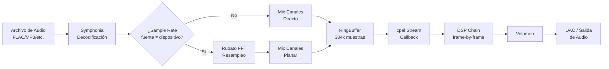

# Optimización del Motor de Audio de Audoxidy

## Contexto del Problema

Cuando el usuario ajusta el sample rate de salida a 384,000 Hz en el centro de audio avanzado, la calidad de audio percibida mejora **enormemente** en **todas las frecuencias** (bajas, medias y altas): todo se escucha más claro, más definido y con mayor fidelidad. Esta diferencia no debería existir en un pipeline bien implementado, ya que el teorema de Nyquist garantiza que 44.1 kHz es suficiente para reproducir todo el espectro audible humano (20 Hz–20 kHz).

Una mejora tan marcada en **todo el espectro** indica que hay **múltiples problemas acumulados** en el pipeline de audio que afectan diferentes rangos de frecuencia.

---

## Arquitectura Actual del Pipeline



### Componentes Clave

| Componente | Archivo | Función |
|---|---|---|
| **Decodificación** | [engine.rs](file:///home/Tix/Proyectos/Audoxidy/Audoxidy/src/audio/engine.rs) | Symphonia decodifica archivos de audio |
| **Resampleo** | [engine.rs](file:///home/Tix/Proyectos/Audoxidy/Audoxidy/src/audio/engine.rs#L718-L803) | Rubato FFT convierte sample rate |
| **Mezcla de Canales** | [engine.rs](file:///home/Tix/Proyectos/Audoxidy/Audoxidy/src/audio/engine.rs#L843-L1010) | Downmix/upmix multicanal |
| **Buffer Circular** | [engine.rs](file:///home/Tix/Proyectos/Audoxidy/Audoxidy/src/audio/engine.rs#L170) | ringbuf HeapRb para comunicación |
| **Salida cpal** | [engine.rs](file:///home/Tix/Proyectos/Audoxidy/Audoxidy/src/audio/engine.rs#L248-L336) | Stream de salida con callback |
| **Cadena DSP** | [dsp.rs](file:///home/Tix/Proyectos/Audoxidy/Audoxidy/src/audio/dsp.rs) | EQ, Reverb, Compresor, etc. |

---

## Diagnóstico Completo: ¿Por Qué se Escucha Mejor a 384 kHz en TODAS las Frecuencias?

La mejora audible en todo el espectro no tiene una sola causa — es el resultado de **7 problemas acumulados** que degradan la calidad de forma combinada. A continuación se analizan uno por uno:

---

### Causa 1: Procesadores de Dinámica con Sample Rate Incorrecto (Afecta TODO el espectro)

> [!CAUTION]
> **Impacto: CRÍTICO — Esta es la causa más probable de la mejora en bajos, medios Y altos**

El `Compressor`, `NoiseGate` y `Limiter` tienen su `sample_rate` hardcodeado a `44100.0`:

```rust
// Compressor (dsp.rs línea 559)
sample_rate: 44100.0,

// NoiseGate (dsp.rs línea 855)
sample_rate: 44100.0,

// Limiter (dsp.rs línea 888)
sample_rate: 44100.0,
```

Estos procesadores usan el sample rate para calcular los coeficientes de sus seguidores de envolvente (attack/release). Cuando el stream real opera a **384,000 Hz** pero los procesadores creen que están a **44,100 Hz**, los tiempos se distorsionan así:

| Parámetro | Valor configurado | A 44,100 Hz (correcto) | A 384,000 Hz (con bug) |
|---|---|---|---|
| Attack compresor | 5 ms | 5 ms | **0.57 ms** (~9x más rápido) |
| Release compresor | 100 ms | 100 ms | **11.5 ms** (~9x más rápido) |
| Attack noise gate | 5 ms | 5 ms | **0.57 ms** |
| Release noise gate | 100 ms | 100 ms | **11.5 ms** |
| Release limiter | 50 ms | 50 ms | **5.7 ms** |

**¿Por qué suena "mejor" a 384 kHz?** A esa frecuencia, estos procesadores de dinámica se vuelven **extremadamente lentos** (sus coeficientes son calculados pensando que hay 44,100 muestras por segundo, pero realmente hay 384,000). Esto significa que:

- El **compresor** apenas comprime → el audio mantiene su **rango dinámico natural**
- El **noise gate** prácticamente no actúa → no corta señales de bajo nivel
- El **limiter** es mucho más suave → menos distorsión en picos

En cambio, a 44,100 Hz los procesadores actúan con tiempos correctos pero pueden estar siendo demasiado agresivos (especialmente si están habilitados en la cadena DSP), degradando la claridad de **todas las frecuencias**.

---

### Causa 2: El Volumen se Aplica ANTES del DSP (Afecta TODO el espectro)

> [!WARNING]
> **Impacto: ALTO — Degrada la relación señal-ruido en todas las frecuencias**

```rust
// engine.rs, línea 316
frame_f32[ch_idx] = val * vol;  // ← Volumen se aplica AQUÍ (antes del DSP)

// Después, el DSP procesa la señal ya atenuada
dsp_lock.process_frame(&mut frame_f32[..channels]);
```

Cuando reduces el volumen (ej. `vol = 0.3`), la señal que llega al DSP es 70% más pequeña. Pero los filtros biquad del EQ tienen un **piso de ruido numérico** constante (ruido de cuantización de f32 y los umbrales de protección contra denormales). Con una señal más pequeña, la relación señal-ruido empeora significativamente.

Adicionalmente, el umbral de denormales en el EQ es demasiado agresivo:

```rust
// dsp.rs línea 349
let y = if y.abs() < 1e-10 { 0.0 } else { y };  // ← Corta señales MUY pequeñas
```

`1e-10` parece un número pequeño, pero después de multiplicar por un volumen bajo (ej. `0.1`), los valores de los bajos pueden acercarse a este umbral, causando **micro-discontinuidades** que se perciben como pérdida de detalle.

---

### Causa 3: Distorsión de Fase y Frequency Cramping de los Filtros Biquad (Afecta MEDIOS y ALTOS)

> [!WARNING]
> **Impacto: ALTO — Los filtros biquad distorsionan la señal cerca de Nyquist**

Los filtros biquad del EQ se diseñan usando la **Transformada Bilineal (BLT)**, que mapea el eje de frecuencia analógico infinito (0 → ∞) al rango digital finito (0 → Nyquist). Esta compresión causa:

1. **Frequency Warping**: Las frecuencias se desplazan de su posición ideal. Una banda de EQ a 8 kHz no afecta exactamente a 8 kHz.
2. **Bandwidth Cramping**: El ancho de banda (Q) de los filtros se comprime cerca de Nyquist. Un filtro con Q=4.4 a 16 kHz a 44,100 Hz tiene un comportamiento significativamente diferente al mismo filtro a 384,000 Hz.
3. **Distorsión de fase**: Los filtros biquad son de fase mínima, lo que significa que causan **retardos diferentes para diferentes frecuencias**. Esto "empaña" los transientes (ataques de instrumentos percusivos, consonantes en la voz, etc.).

| Banda EQ | A 44,100 Hz (Nyquist: 22,050 Hz) | A 384,000 Hz (Nyquist: 192,000 Hz) |
|---|---|---|
| 100 Hz (bass) | 0.45% de Nyquist — mínima distorsión | 0.05% — ideal |
| 1,000 Hz (mids) | 4.5% de Nyquist — distorsión leve | 0.52% — ideal |
| 4,000 Hz (mids-altos) | 18% de Nyquist — distorsión moderada | 2.1% — ideal |
| 10,000 Hz (altos) | 45% de Nyquist — **distorsión severa** | 5.2% — ideal |
| 16,000 Hz (brillo) | 73% de Nyquist — **distorsión extrema** | 8.3% — ideal |
| 20,000 Hz (aire) | 91% de Nyquist — **comportamiento degenerado** | 10.4% — ideal |

Incluso a 1,000 Hz, la distorsión de fase es 9x mayor a 44,100 Hz que a 384,000 Hz, lo que explica por qué los **medios** también se escuchan más claros.

---

### Causa 4: El Reverb tiene Delay Lines de Tamaño Fijo (Afecta TODO el espectro)

```rust
// dsp.rs, líneas 463-465
let comb_tunings = [1617, 1693, 1781, 1867, 1951, 2053, 2153, 2251];
let allpass_tunings = [556, 441, 341, 225];
```

| Filtro | A 44,100 Hz | A 384,000 Hz |
|---|---|---|
| Comb 1617 muestras | **36.7 ms** delay | **4.2 ms** delay |
| Allpass 556 muestras | **12.6 ms** | **1.4 ms** |

A 384,000 Hz el reverb se vuelve extremadamente corto y casi imperceptible. Si el reverb estuviera activo, a 44,100 Hz estaría coloreando el audio significativamente, mientras que a 384 kHz sería transparente.

---

### Causa 5: Denormales Agresivos en los Filtros (Afecta señales de bajo nivel en TODO el espectro)

El umbral de denormales `1e-10` en el filtro biquad del EQ causa micro-saltos a cero cuando los valores son muy pequeños. Esto afecta especialmente:
- Colas de reverberación
- Pasajes silenciosos (pianissimo)
- Decaimiento de notas de instrumentos

A frecuencias más altas, hay más muestras por ciclo, así que estos micro-saltos se diluyen y son menos perceptibles.

---

### Causa 6: RingBuffer de Tamaño Fijo (Afecta estabilidad a tasas altas)

```rust
let rb = HeapRb::<f32>::new(48000 * 2 * 4); // = 384,000 muestras fijas
```

A 384,000 Hz estéreo: solo 0.5 segundos de buffer → riesgo de underruns.
A 44,100 Hz estéreo: 4.35 segundos → más que suficiente.

---

### Causa 7: El DSP se procesa frame-by-frame con RwLock en el callback de audio

```rust
// engine.rs, línea 310
let mut dsp_lock = dsp.write(); // ← Write lock en el hilo de audio
```

Un `RwLock::write()` en el callback de audio puede causar **inversión de prioridad** si la GUI o algún otro hilo está accediendo al DSP simultáneamente. Esto puede resultar en **glitches** (clicks y pops) impredecibles que degradan la experiencia de audio en general.

---

## Análisis de Crates: `dasp` y `rustfft`

### `dasp` — Digital Audio Signal Processing

| Aspecto | Detalle |
|---|---|
| **¿Qué es?** | Suite modular de crates para procesamiento de audio digital PCM. Proporciona abstracciones como `Sample`, `Frame` y `Signal` para trabajar genéricamente con audio |
| **Funciones principales** | Trait `Sample` (genérico sobre profundidad de bits), trait `Signal` (iterador sobre frames de audio), interpolación (floor, lineal, sinc), ring buffer, conversión de formato de muestra |
| **Features habilitados** | `signal`, `interpolate`, `interpolate-linear`, `ring_buffer` |
| **¿Se usa actualmente?** | **NO** — No hay ningún `use dasp` ni referencia a `dasp` en el código fuente |

#### ¿Debemos implementarlo?

> [!NOTE]
> **Recomendación: NO es necesario implementarlo ahora.** Las funcionalidades que `dasp` ofrece ya están cubiertas por nuestro stack actual:
> - **Resampleo**: Rubato es superior en calidad a `dasp_interpolate` (Rubato usa FFT sinc de alta calidad; dasp ofrece interpolación lineal básica)
> - **Ring Buffer**: Ya usamos `ringbuf` que es lock-free y más eficiente que el ring buffer de dasp
> - **Signal trait**: Nuestro pipeline usa slices directos de f32, que es más eficiente que la abstracción de Signal
> - **Conversión de formato**: `cpal::FromSample` ya maneja esto

#### ¿Cómo podría ayudar?

El único caso donde `dasp` sería útil es si en el futuro quisiéramos:
- Un pipeline genérico que soporte diferentes profundidades de bits internamente
- Usar su trait `Signal` para componer procesadores de forma declarativa
- Pero esto añadiría overhead por la capa de abstracción

#### Impacto en rendimiento

- **Mínimo** si se usa correctamente, ya que dasp está diseñado para zero-allocation
- Sin embargo, las abstracciones de `Signal` y `Frame` añaden indirección que puede prevenir que el compilador optimice tan agresivamente como con slices directos de f32

> [!TIP]
> **Conclusión: Se recomienda eliminar `dasp` de las dependencias** ya que no se usa y solo añade tiempo de compilación (~5-10 segundos). Si en el futuro se necesita alguna funcionalidad específica de dasp, se puede añadir de nuevo.

---

### `rustfft` — Fast Fourier Transform

| Aspecto | Detalle |
|---|---|
| **¿Qué es?** | Librería de FFT de alto rendimiento en Rust puro. Estándar de la industria, rivalizando con FFTW (librería de C) |
| **Funciones principales** | FFT directa e inversa, soporte para cualquier tamaño (no solo potencias de 2), aceleración SIMD automática (AVX, SSE, NEON) |
| **¿Se usa actualmente?** | **NO** — No hay ningún `use rustfft` en el código fuente |
| **Nota** | Rubato ya usa `realfft` internamente (que depende de `rustfft`), así que la dependencia existe transitivamente |

#### ¿Debemos implementarlo?

> [!IMPORTANT]
> **Recomendación: SÍ, pero como mejora futura (Fase 3+).** `rustfft` habilitaría funcionalidades avanzadas muy valiosas:

**1. Ecualizador en Dominio de Frecuencia (Frequency-Domain EQ)**
- En lugar de 31 filtros biquad en cascada (que acumulan distorsión de fase), podemos:
  - FFT del bloque de audio
  - Multiplicar cada bin de frecuencia por la ganancia deseada
  - Inversa FFT para volver al dominio temporal
- **Ventajas**: Elimina completamente el frequency cramping, fase perfectamente lineal, sin distorsión cerca de Nyquist
- **Desventajas**: Introduce latencia equivalente al tamaño de la FFT (ej. 2048 muestras = ~46ms a 44,100 Hz), requiere pipeline de overlap-add

**2. Analizador de Espectro / Visualizador**
- Mostrar en la GUI un espectrograma en tiempo real del audio que se reproduce
- Windowing (Hann/Blackman) → FFT → Cálculo de magnitud → Render

**3. Reverb por Convolución**
- Reverb de alta calidad basado en impulse responses (IRs) reales
- Convolución en dominio de frecuencia: FFT(audio) × FFT(IR) → IFFT
- Calidad cinematográfica muy superior al Freeverb actual

#### Impacto en rendimiento

| Operación | CPU (estimada) |
|---|---|
| FFT de 2048 puntos (f32) | ~5-15 μs (con AVX) |
| EQ en dominio de frecuencia | ~20-30 μs por bloque |
| Convolución reverb (IR de 1s) | ~50-100 μs por bloque |

> [!TIP]
> **Conclusión: Mantener `rustfft` como dependencia** para usarlo en fases futuras. Hoy no necesitamos implementarlo para la Fase 1, pero es un asset valioso para las fases de mejora de EQ y reverb.

---

### Resumen de Recomendación sobre Crates

| Crate | Acción | Razón |
|---|---|---|
| `dasp` | 🔴 **Eliminar** | No se usa, no aporta nada que no tengamos. Solo aumenta tiempo de compilación |
| `rustfft` | 🟡 **Mantener** | No se usa ahora, pero será útil para EQ frecuencial y reverb por convolución en fases futuras |
| `hrtf` | 🟡 **Mantener** | Se implementará en fases posteriores |

---

## Decisiones del Usuario

| Pregunta | Decisión |
|---|---|
| ¿Fases? | Iremos **fase por fase**, empezando por la **Fase 1** |
| ¿DSP dónde? | **Mover al hilo de decodificación** (mejor calidad y rendimiento) |
| ¿Reverb al cambiar SR? | **Sí, se puede recrear** (se rediseñará en fases posteriores) |

---

## Plan de Implementación — Fase 1: Correcciones Críticas

### Cambios Propuestos

---

#### Componente: Cadena DSP

##### [MODIFY] [dsp.rs](file:///home/Tix/Proyectos/Audoxidy/Audoxidy/src/audio/dsp.rs)

**Cambio 1: Propagar `set_sample_rate()` a TODOS los procesadores**
- Agregar método `set_sample_rate()` al `Compressor`, `NoiseGate` y `Limiter`
- Actualizar `DspChain::set_sample_rate()` para llamar a todos los procesadores
- Esto corrige los tiempos de attack/release en todo el espectro

**Cambio 2: Adaptar el Reverb al sample rate**
- Agregar método `set_sample_rate()` al `Reverb` que recree los delay lines escalados proporcionalmente: `tamaño_nuevo = tamaño_base * (nuevo_sr / 44100.0)`
- Los comb filters y allpass filters tendrán tiempos correctos a cualquier sample rate

**Cambio 3: Mejorar la protección contra denormales**
- Cambiar el umbral de `1e-10` a `1e-20` o usar la técnica de suma de una constante DC sub-audible
- La técnica DC offset es más robusta: sumar `1e-25` a la entrada evita que los valores lleguen a cero exacto sin afectar la señal audible

---

#### Componente: Motor de Audio (Pipeline)

##### [MODIFY] [engine.rs](file:///home/Tix/Proyectos/Audoxidy/Audoxidy/src/audio/engine.rs)

**Cambio 4: Mover el DSP al hilo de decodificación (ANTES del RingBuffer)**

El pipeline actual:
```
Decodificación → Resampleo → Mix → RingBuffer → [callback] → DSP → Volumen → Salida
```

El pipeline nuevo:
```
Decodificación → Resampleo → Mix → DSP → Volumen → RingBuffer → [callback] → Salida
```

Esto implica:
- En `audio_decode_loop()`: después de hacer resampleo y mezcla, aplicar la cadena DSP sobre los bloques resultantes **antes** de enviarlos al RingBuffer
- En `write_data_impl()`: el callback solo lee del RingBuffer y escribe al stream — sin DSP, sin locks pesados
- El DSP ahora procesa **bloques completos** en vez de frame-by-frame (mucho más eficiente)

**Cambio 5: Mover la aplicación del volumen DESPUÉS del DSP**
- En el hilo de decodificación, el orden será: DSP → Volumen → RingBuffer
- Esto mejora la relación señal-ruido porque el DSP recibe la señal a nivel completo

**Cambio 6: Escalar el RingBuffer proporcionalmente al sample rate**
- Fórmula: `tamaño = (sample_rate * channels * 2)` (≈2 segundos de buffer)
- Se recalcula en `configure_and_start_stream()`
- Mínimo: 384,000 muestras (el actual), máximo: 1,536,000 muestras (para 384 kHz estéreo)

**Cambio 7: Usar `FixedSync::Both` en el resampler FFT**
- Cambiar `FixedSync::Output` a `FixedSync::Both`
- Según la documentación de rubato, este modo evita buffering interno y es más eficiente para conversiones de tasa fija

---

#### Componente: Dependencias

##### [MODIFY] [Cargo.toml](file:///home/Tix/Proyectos/Audoxidy/Audoxidy/Cargo.toml)

**Cambio 8: Eliminar dependencia `dasp`**
- Eliminar la línea `dasp = { version = "0.11.0", ... }` ya que no se usa

---

## Plan de Verificación

### Pruebas Automatizadas
- `cargo test` — Validar que los tests existentes siguen pasando
- `cargo build --release` — Validar compilación optimizada sin errores
- `cargo clippy` — Validar que no hay warnings nuevos

### Verificación Manual
- Reproducir audio a **44,100 Hz** y comparar la claridad subjetiva con la versión anterior
- Reproducir audio a **384,000 Hz** y verificar que sigue sonando igual de bien (no debe empeorar)
- Verificar que al cambiar el sample rate en el centro de audio avanzado no hay clicks, pops, o interrupciones
- Verificar que el EQ, compresor, reverb, y demás efectos DSP funcionan correctamente a distintos sample rates
- Monitorear uso de CPU antes y después de las optimizaciones (debería reducirse significativamente)
