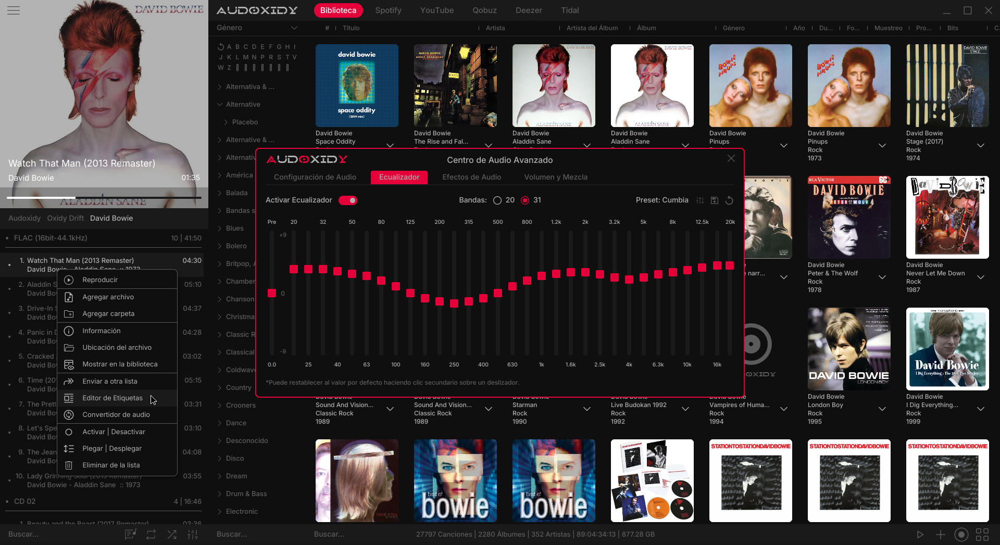

# Audoxidy

**High-fidelity audio player built entirely in Rust.**

Audoxidy is a desktop audio player powered by a custom audio engine and a modern interface built with [Iced](https://iced.rs/). Designed for listeners who care about sound quality, it delivers advanced DSP processing, seamless transitions, and a responsive, native experience across Linux, Windows, and macOS.



## Features

### Format Support

Plays MP3, FLAC, WAV, OGG, AAC, M4A, and more.

### Audio Engine

- **Custom high-performance audio engine** — built from the ground up in Rust for low-latency playback and precise audio control
- **Advanced DSP chain** — parametric EQ (20 or 31 IEC standard bands), dynamic compressor, true-peak limiter, reverb with HRTF, stereo expansion, noise gate, sub-bass/mid-bass enhancement, and voice boost
- **SIMD-optimized processing** — EQ biquad filters use vectorized operations for minimal CPU overhead
- **Multi-channel support** — handles 2.1, 5.1, and 7.1 channel audio with intelligent downmixing

### Playback & Transitions

- **Seamless crossfade** — forward crossfade with equal-power curves for transparent song transitions
- **Pre-loading system** — next track is decoded in advance to eliminate gaps between songs
- **Volume smoothing** — natural fade-in/fade-out with configurable ramp times, no clicks or pops
- **ReplayGain** — automatic volume normalization with track and album gain from metadata tags
- **Real-time loudness analysis** — fallback normalization when ReplayGain tags are absent

### Library & Organization

- **SQLite library** — fast, relational music library with full-text search (FTS5)
- **Multiple view modes** — Grid, Detailed List, Thumbnail List, and Simple List
- **Smart filters** — browse by folder, artist, album, genre, or year with a collapsible sidebar
- **Playlists** — create, edit, reorder, shuffle, and persist playlists with drag-and-drop support
- **Shuffle sessions** — remembers shuffle state across restarts

### Interface

- **Native desktop GUI** — built with Iced 0.14, a GPU-accelerated Rust GUI framework
- **Dynamic theming** — dark theme with customizable accent colors
- **Keyboard navigation** — full keyboard support across library, playlist, and player controls
- **System media controls** — integrates with MPRIS (Linux) and SMTC (Windows) for OS-level playback control
- **Audio settings center** — dedicated panel for device configuration, EQ presets, DSP effects, and crossfade settings

### Performance & Efficiency

- **Memory management** — automatic garbage collection, RAM monitoring, and adaptive resource usage
- **Low-resource mode** — reduces buffer sizes and cache limits on constrained systems
- **Cover art pipeline** — AVIF-compressed album art with LRU caching and background processing
- **String interning** — shared string storage to minimize memory footprint across the library

## Quick Start

```bash
# Prerequisites (Linux)
sudo apt install libasound2-dev libdav1d libdav1d-dev libpipewire-0.3-dev  # ALSA + PipeWire

# Build and run
cargo build --release
cargo run --release
```

The configuration file is automatically created at `~/.config/audoxidy/config.ron` on first launch.

## Roadmap

*Coming soon — new features and improvements will be listed here.*

## Contributing

Please read [CONTRIBUTING.md](CONTRIBUTING.md) for details on the development setup, code style, and the process for submitting pull requests.

## License

This project is licensed under the **GNU General Public License v3.0** — see the [LICENSE](LICENSE) file for details.

## Author

**ZiggyByte** — *Initial Work & Main Developer*
